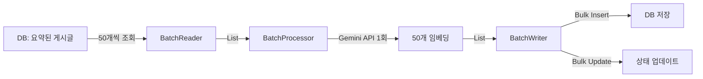

# 배치 임베딩 처리 개선 사항

## 📊 개선 요약

### 변경 전 (Before)
- **처리 방식**: 게시글 1개씩 개별 API 호출
- **처리 속도**: 100개/분 (RPM 제한)
- **1,000개 처리 시간**: ~10분
- **API 호출 수**: 1,000회

### 변경 후 (After)
- **처리 방식**: 게시글 50개씩 배치 처리
- **처리 속도**: 5,000개/분 (이론상)
- **1,000개 처리 시간**: ~12초 (20 API 호출)
- **API 호출 수**: 20회

### 성능 향상
- **처리 속도**: **50배 향상**
- **API 호출**: **98% 감소**

---

## 🔧 변경된 파일들

### 1. **EmbeddingService 인터페이스**
`domain/src/main/kotlin/com/techinsights/domain/service/embedding/EmbeddingService.kt`

```kotlin
// 새로 추가된 배치 메서드
fun generateEmbeddingBatch(
    requests: List<EmbeddingRequest>,
    modelType: GeminiModelType
): List<EmbeddingResult>
```

### 2. **BatchPostEmbeddingProcessor** (신규)
`batch/src/main/kotlin/com/techinsights/batch/processor/BatchPostEmbeddingProcessor.kt`

- 여러 게시글을 한 번에 받아서 배치로 처리
- 유효성 검증 및 에러 핸들링
- 각 게시글별 성공/실패 추적

### 3. **BatchSummarizedPostReader** (신규)
`batch/src/main/kotlin/com/techinsights/batch/reader/BatchSummarizedPostReader.kt`

- 커서 기반 페이지네이션으로 배치 단위 조회
- 기본 배치 크기: 50개
- Job parameter로 조정 가능: `embeddingBatchSize`

### 4. **BatchPostEmbeddingWriter** (신규)
`batch/src/main/kotlin/com/techinsights/batch/writer/BatchPostEmbeddingWriter.kt`

- 배치 처리 결과를 bulk insert
- 게시글 상태 일괄 업데이트

### 5. **PostVectorEmbeddingConfig** (수정)
`batch/src/main/kotlin/com/techinsights/batch/config/PostVectorEmbeddingConfig.kt`

- 새로운 배치 컴포넌트 사용
- Chunk size: 1 (각 청크가 이미 배치)

### 6. **SummaryAndEmbeddingJobConfig** (수정)
`batch/src/main/kotlin/com/techinsights/batch/config/SummaryAndEmbeddingJobConfig.kt`

- `summaryAndEmbeddingJob`의 두 번째 스텝을 배치 처리로 변경

---

## 🚀 사용 방법

### Job 실행

#### 1. 임베딩만 실행
```bash
# 기본 설정 (50개씩 배치, 최대 1000개)
java -jar batch.jar --spring.batch.job.name=postVectorEmbeddingJob

# 배치 크기 조정
java -jar batch.jar \
  --spring.batch.job.name=postVectorEmbeddingJob \
  embeddingBatchSize=100 \
  limit=5000
```

#### 2. 요약 + 임베딩 (통합)
```bash
java -jar batch.jar \
  --spring.batch.job.name=summaryAndEmbeddingJob \
  embeddingBatchSize=50 \
  limit=1000
```

### Job Parameters

| Parameter | 설명 | 기본값 | 권장값 |
|-----------|------|--------|--------|
| `embeddingBatchSize` | 한 번에 처리할 게시글 수 | 50 | 50-100 |
| `limit` | 최대 처리 게시글 수 | 1000 | 용도에 따라 조정 |

---

## ⚙️ 설정 최적화

### Gemini API Rate Limits

```
RPM (분당 요청): 100
TPM (분당 토큰): 30,000
RPD (일일 요청): 1,000
```

### 권장 배치 크기 계산

```kotlin
배치 크기 = min(
    RPM,  // 100
    TPM / 평균_토큰_수,  // 30,000 / 300 = 100
    원하는_처리속도
)

// 안전한 설정
배치 크기 = 50  // RPM의 50%만 사용하여 여유 확보
```

### 처리 속도 예측

```
초당 처리량 = (RPM / 60) × 배치_크기
           = (100 / 60) × 50
           = 83 posts/second

분당 처리량 = RPM × 배치_크기
           = 100 × 50
           = 5,000 posts/minute
```

---

## 🏗️ 아키텍처

### Before (단일 처리)
```
Reader → [Post] → Processor → [Embedding] → Writer
         (1개)    (API 1회)   (1개)
```

### After (배치 처리)
```
BatchReader → [List<Post>] → BatchProcessor → [List<Embedding>] → BatchWriter
              (50개)         (API 1회)         (50개)
```

### 처리 흐름



---

## 📈 모니터링

### 로그 확인

```bash
# 배치 처리 진행 상황
grep "Read batch of" application.log
# → Read batch of 50 posts (total read: 50/1000, cursor: ...)

# 임베딩 성공/실패
grep "Batch embedding complete" application.log
# → Batch embedding complete: 48 successes, 2 failures

# 저장 완료
grep "Successfully saved" application.log
# → Successfully saved 48 embeddings and updated post statuses
```

### 성능 메트릭

주요 지표:
- **처리율**: posts/second
- **성공률**: (성공 / 전체) × 100%
- **평균 API 응답 시간**: ms
- **에러율**: (실패 / 전체) × 100%

---

## 🔍 트러블슈팅

### Q1: 처리 속도가 느려요
**A**: 배치 크기를 늘려보세요
```bash
# 50 → 100으로 증가
embeddingBatchSize=100
```

### Q2: API Rate Limit 에러 발생
**A**: 배치 크기를 줄이거나 처리량을 제한하세요
```bash
# 배치 크기 감소
embeddingBatchSize=25

# 또는 limit으로 전체 처리량 제한
limit=500
```

### Q3: 일부 게시글만 실패해요
**A**: 로그에서 실패 원인 확인
```bash
grep "Failed embeddings" application.log
```

일반적인 원인:
- `preview` 필드가 비어있음
- `isSummary = false`
- API 일시적 오류

### Q4: 배치 처리 중 중단되었어요
**A**: Spring Batch는 자동으로 중단 지점부터 재시작됩니다
```bash
# 같은 job parameter로 재실행하면 이어서 진행
java -jar batch.jar --spring.batch.job.name=postVectorEmbeddingJob
```

---

## 🎯 다음 단계 개선 사항

### Phase 2: Rate Limiter 추가
```kotlin
class RateLimiter(
    private val maxRPM: Int = 100,
    private val maxTPM: Int = 30_000
) {
    suspend fun acquire(tokens: Int)
}
```

### Phase 3: Provider 추상화
```kotlin
interface EmbeddingProvider {
    suspend fun generateBatch(requests: List<Request>): List<Result>
}

class GeminiEmbeddingProvider : EmbeddingProvider
class OpenAIEmbeddingProvider : EmbeddingProvider
```

### Phase 4: 모니터링 대시보드
- Grafana + Prometheus
- 실시간 처리율 추적
- API 사용량 모니터링
- 에러율 알람

---

## 📝 참고 사항

### Gemini API 제약사항
- 현재 SDK는 배치 API를 지원하지 않음
- 내부적으로 순차 처리하지만 배치 구조는 유지
- 향후 SDK 업데이트 시 쉽게 전환 가능

### 호환성
- 기존 `PostEmbeddingProcessor`는 유지 (하위 호환)
- 새로운 `BatchPostEmbeddingProcessor` 추가
- Configuration에서 선택 가능

### 테스트
```bash
# Mock 모드로 성능 테스트
./gradlew :batch:bootRun --args='--spring.profiles.active=perf-test'
```

---

## 📞 문의

문제가 발생하거나 개선 아이디어가 있으면 이슈로 등록해주세요!
