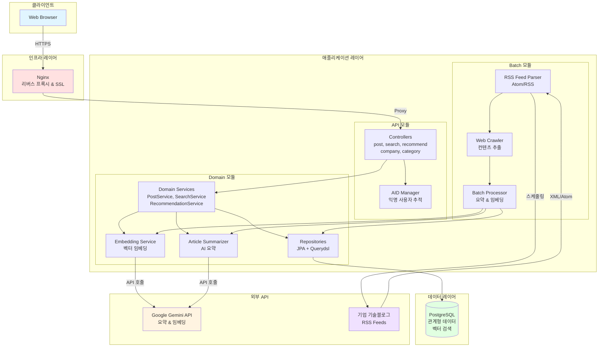
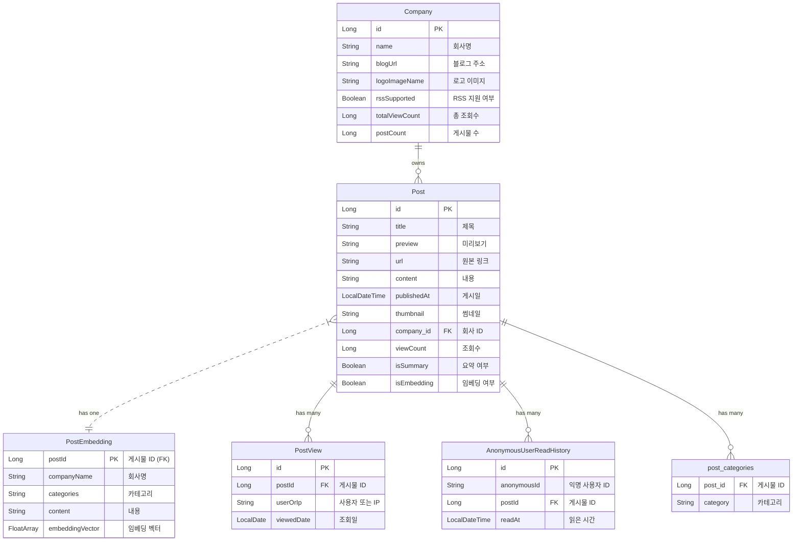

# Tech Insights - Backend Service

## 프로젝트 개요

Tech Insights는 최신 IT 기술 관련 회사들의 기술 블로그 게시글을 모아 보여주는 플랫폼입니다. 사용자는 다양한 카테고리별 최신 글과 인기 글을 탐색할 수 있으며, 회사별 블로그 요약, 게시글 상세 보기, 댓글 작성, 좋아요 등의 기능을 제공합니다.

## 주요 기능

- 기업별 기술블로그 피드
  - 각 기업의 최신 기술 아티클을 수집하여 요약 및 원문 링크를 제공합니다.
  - 조회수, 게시물 수 기반으로 주목받는 기업 랭킹을 확인할 수 있습니다.

- 콘텐츠 탐색 및 검색
  - AI, Backend, Frontend 등 기술 카테고리별로 게시글을 필터링하여 볼 수 있습니다.
  - 실시간 검색으로 빠르게 원하는 정보를 찾고, 관련도순/최신순으로 정렬하는 상세 검색을 지원합니다.

- AI 기반 개인화 추천
  - 사용자의 콘텐츠 조회 이력을 바탕으로 AI가 흥미로워할 만한 아티클을 개인화하여 추천합니다.
  - 게시글의 의미를 분석한 벡터 검색을 통해 관련성 높은 콘텐츠를 제공합니다.

- 인사이트 및 통계
  - 인기글, AI 추천글 등 다양한 기준으로 집계된 통계 정보를 제공합니다.
  - 카테고리별 게시글 수, 기업별 포스팅 현황 등을 차트로 시각화하여 보여줍니다.

- 상세 보기 및 조회수
  - 각 아티클의 AI 요약, 태그, 원문 링크 등 상세 정보를 확인할 수 있습니다.
  - 사용자의 IP를 기반으로 조회수를 집계하여 게시글의 인기도를 측정합니다.

## 시스템 아키텍처

## 기술 스택

- **Language:** Kotlin
- **Backend:** Spring Boot, Spring Batch, Spring Data JPA
- **AI:** Google Gemini API (Embedding & Vector Search)
- **Build Tool:** Gradle
- **Infra:** Docker, Docker Compose, Nginx
- **CI/CD:** GitHub Actions, AWS CodeDeploy

## 개발 환경

- JDK 21
- Gradle 빌드 시스템
- Docker (개발/배포용)

## 접속 링크

https://www.techinsights.shop/

## Preview

| 검색 기능                                                            | 세부 페이지                                                                | 다크모드                                                              |
|------------------------------------------------------------------|-----------------------------------------------------------------------|-------------------------------------------------------------------|
|  |  |  |

### 데이터베이스 ERD

## ERD

### Initial Design

Home

