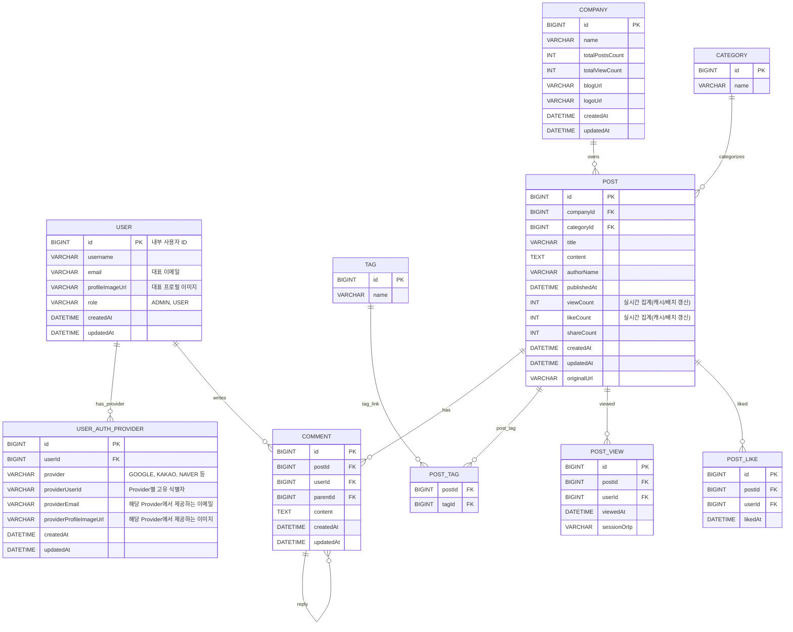

# Tech Insights - Backend Service

## 프로젝트 개요

Tech Insights는 최신 IT 기술 관련 회사들의 기술 블로그 게시글을 모아 보여주는 플랫폼입니다. 사용자는 다양한 카테고리별 최신 글과 인기 글을 탐색할 수 있으며, 회사별 블로그 요약, 게시글 상세 보기, 댓글 작성, 좋아요 등의 기능을 제공합니다.

## 주요 기능

- 회사별 기술 블로그 요약 및 링크 제공
- 카테고리별 게시글 목록 및 검색 기능
- 인기글, 트렌딩 글 통계 및 차트 제공
- 게시글 상세 보기 및 댓글 기능
- 사용자 인증 및 권한 관리 (관리자, 일반 사용자 구분)

## 기술 스택

- 언어: Kotlin
- 프레임워크: Spring Boot
- 데이터베이스: MySQL 또는 PostgreSQL
- API 문서화: Swagger/OpenAPI
- 보안: Spring Security (인증은 OAUTH2, 인가는 JWT, RefreshToken도 추가.)

## 개발 환경

- JDK 21
- Gradle 빌드 시스템
- Docker (개발/배포용)

## Initial Design

### 데이터베이스 ERD

### Design

Home

