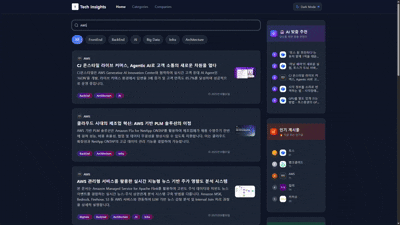

# Tech Insights - Backend Service

## 프로젝트 개요

Tech Insights는 최신 IT 기술 관련 회사들의 기술 블로그 게시글을 모아 보여주는 플랫폼입니다. 사용자는 다양한 카테고리별 최신 글과 인기 글을 탐색할 수 있으며, 회사별 블로그 요약, 게시글 상세 보기, 댓글 작성, 좋아요 등의 기능을 제공합니다.

---

### Tech Stack

[](https://kotlinlang.org/)
[](https://spring.io/projects/spring-boot)
[](https://spring.io/projects/spring-batch)
[](https://www.postgresql.org/)
[](https://github.com/pgvector/pgvector)
[](https://www.docker.com/)
[](https://openjdk.org/)

### AI & Libraries

[](https://ai.google.dev/)
[](https://hibernate.org/)
[](https://querydsl.com/)
[](https://resilience4j.readme.io/)

### Testing & Quality

[](https://junit.org/junit5/)
[](https://kotest.io/)
[](https://mockk.io/)
[](https://www.jacoco.org/)
[](https://sonarcloud.io/)

### DevOps & Infrastructure

[](https://nginx.org/)
[](https://github.com/features/actions)
[](https://aws.amazon.com/)
[](https://gradle.org/)

### Architecture & Design Patterns

[]()
[]()
[]()
[]()

---
## Preview

| 검색 기능                                                            | 세부 페이지                                                                | 다크모드                                                              |
|------------------------------------------------------------------|-----------------------------------------------------------------------|-------------------------------------------------------------------|
|  |  |  |

---

## 주요 기능

- 기업별 기술블로그 피드
  - 각 기업의 최신 기술 아티클을 수집하여 요약 및 원문 링크를 제공합니다.
  - 조회수, 게시물 수 기반으로 주목받는 기업 랭킹을 확인할 수 있습니다.

- 콘텐츠 탐색 및 검색
  - AI, Backend, Frontend 등 기술 카테고리별로 게시글을 필터링하여 볼 수 있습니다.
  - 실시간 검색으로 빠르게 원하는 정보를 찾고, 관련도순/최신순으로 정렬하는 상세 검색을 지원합니다.

- AI 기반 개인화 추천
  - 사용자의 콘텐츠 조회 이력을 바탕으로 AI가 흥미로워할 만한 아티클을 개인화하여 추천합니다.
  - 게시글의 의미를 분석한 벡터 검색을 통해 관련성 높은 콘텐츠를 제공합니다.

- 인사이트 및 통계
  - 인기글, AI 추천글 등 다양한 기준으로 집계된 통계 정보를 제공합니다.
  - 카테고리별 게시글 수, 기업별 포스팅 현황 등을 차트로 시각화하여 보여줍니다.

- 상세 보기 및 조회수
  - 각 아티클의 AI 요약, 태그, 원문 링크 등 상세 정보를 확인할 수 있습니다.
  - 사용자의 IP를 기반으로 조회수를 집계하여 게시글의 인기도를 측정합니다.

---

## 시스템 아키텍처

API Sever


Batch Server


Crawling Sequence Diagram


---

## ERD


---

## Technical Challenges & Solutions

개발 과정에서 마주한 기술적 도전과 해결 방안을 정리했습니다.

| 주제 | 핵심 기술 | 성능 개선 |
|------|----------|----------|
| [배치 처리 아키텍처 고도화](./TECHNICAL_CHALLENGES.md#1-배치-처리-아키텍처-고도화) | 스트리밍 + DynamicBatchBuilder + 부분 성공 처리 | 일일 처리량 7배 향상 (20건 → 140건), 배치 처리 시간 84.6% 단축 |
| [N+1 쿼리 최적화](./TECHNICAL_CHALLENGES.md#2-n1-쿼리-최적화) | Querydsl fetchJoin, @BatchSize | 쿼리 99.5% 감소 (2001회 → 11회) |
| [벡터 검색 성능 최적화](./TECHNICAL_CHALLENGES.md#3-벡터-검색-성능-최적화) | pgvector, L2 Distance, 평균 벡터 기법 | 쿼리 10회 → 1회 |
| [조회수 집계 트랜잭션 최적화](./TECHNICAL_CHALLENGES.md#4-조회수-집계-트랜잭션-최적화) | Spring Event, @TransactionalEventListener | Lock 경합 해소 |
| [Gemini API Rate Limit 관리](./TECHNICAL_CHALLENGES.md#5-gemini-api-rate-limit-관리) | Resilience4j (RateLimiter, Circuit Breaker) | API 호출 효율 5배 향상 (20회 → 4회/20건) |
| [스트리밍 기반 타임아웃 방지](./TECHNICAL_CHALLENGES.md#6-스트리밍-기반-타임아웃-방지) | generateContentStream, StreamingJsonParser | 타임아웃 발생률 83% 감소 (12% → 2%) |
| [RSS/Atom 피드 파싱](./TECHNICAL_CHALLENGES.md#7-rssatom-피드-파싱-및-중복-처리) | Strategy Pattern, URL 기반 중복 감지 | - |
| [배치 요약 검증](./TECHNICAL_CHALLENGES.md#8-배치-요약-검증) | AI 응답 품질 검증, ID 매칭 | - |
| [요약 실패 관리 및 재시도](./TECHNICAL_CHALLENGES.md#9-요약-실패-관리-및-재시도) | 지수 백오프, 실패 이력 추적 | 최대 재시도 7회 (즉시 2 + 배치 5) |

상세 내용은 [TECHNICAL_CHALLENGES.md](./TECHNICAL_CHALLENGES.md)를 참고하세요.

---

## Quick Start

### Prerequisites

- **JDK 21**
- **Docker & Docker Compose**
- **Gradle 8.5+** (Wrapper 포함)

### 환경 설정

프로젝트 루트에 `.env` 파일을 생성합니다:

```env
DB_PASSWORD=your_password
GEMINI_API_KEY=your_gemini_api_key
```

### 로컬 실행

```bash
# 1. 저장소 클론
git clone https://github.com/kitoha/TechInsights-Server.git
cd TechInsights-Server

# 2. DB 실행 (PostgreSQL + pgvector)
docker-compose -f docker-compose.db.yml up -d

# 3. 빌드
./gradlew clean build

# 4. API 서버 실행
./gradlew :api:bootRun
```

API 서버: http://localhost:8080

Health Check: http://localhost:8080/actuator/health

---

## 프로젝트 구조

```
TechInsights-Server/
├── api/                     # REST API 모듈 (Spring Boot Web)
│   ├── src/main/kotlin/
│   └── Dockerfile
├── batch/                   # 배치 처리 모듈 (Spring Batch)
│   ├── src/main/kotlin/
│   └── Dockerfile
├── domain/                  # 공통 도메인 모듈 (JPA, Querydsl)
│   └── src/main/kotlin/
├── gradle/                  # Gradle 버전 카탈로그
│   └── libs.versions.toml
├── docker-compose.yml       # 로컬 전체 환경 (API + DB + Nginx)
├── docker-compose.db.yml    # DB만 실행
├── docker-compose.app.yml   # API + Nginx
└── docker-compose.prod.yml  # 프로덕션 환경
```

### 모듈 의존성

```
api ──┬──→ domain
batch ─┘
```

| 모듈 | 역할 |
|------|------|
| `api` | REST API 엔드포인트, 컨트롤러, 인증/인가 |
| `batch` | RSS 피드 크롤링, AI 요약, 임베딩 생성 |
| `domain` | 엔티티, 리포지토리, 도메인 서비스 |

---

## Docker

| 파일 | 용도 | 명령어 |
|------|------|--------|
| `docker-compose.db.yml` | PostgreSQL + pgvector | `docker-compose -f docker-compose.db.yml up -d` |
| `docker-compose.yml` | 전체 로컬 환경 | `docker-compose up -d` |
| `docker-compose.app.yml` | API + Nginx | `docker-compose -f docker-compose.app.yml up -d` |
| `docker-compose.prod.yml` | 프로덕션 (AWS) | CodeDeploy로 실행 |

### Docker 이미지 빌드

```bash
# API 이미지 빌드
docker build -t techinsights-api ./api

# Batch 이미지 빌드
docker build -t techinsights-batch ./batch
```

---

## 테스트

```bash
# 전체 테스트 실행
./gradlew test

# 모듈별 테스트
./gradlew :api:test
./gradlew :batch:test
./gradlew :domain:test

# 커버리지 리포트 생성
./gradlew jacocoTestReport
```

커버리지 리포트: `build/reports/jacoco/test/html/index.html`

### 테스트 스택
- **JUnit 5** - 테스트 프레임워크
- **Kotest** - Kotlin 테스트 라이브러리
- **MockK** - Kotlin 모킹 라이브러리
- **JaCoCo** - 코드 커버리지

---

## Initial Design


---

## 접속 링크

https://www.techinsights.shop/
