# Tech Insights - Backend Service

## 프로젝트 개요

Tech Insights는 최신 IT 기술 관련 회사들의 기술 블로그 게시글을 모아 보여주는 플랫폼입니다. 사용자는 다양한 카테고리별 최신 글과 인기 글을 탐색할 수 있으며, 회사별 블로그 요약, 게시글 상세 보기, 댓글 작성, 좋아요 등의 기능을 제공합니다.

## 주요 기능

- 기업별 기술블로그 피드
  - 각 기업의 최신 기술 아티클을 수집하여 요약 및 원문 링크를 제공합니다.
  - 조회수, 게시물 수 기반으로 주목받는 기업 랭킹을 확인할 수 있습니다.

- 콘텐츠 탐색 및 검색
  - AI, Backend, Frontend 등 기술 카테고리별로 게시글을 필터링하여 볼 수 있습니다.
  - 실시간 검색으로 빠르게 원하는 정보를 찾고, 관련도순/최신순으로 정렬하는 상세 검색을 지원합니다.

- AI 기반 개인화 추천
  - 사용자의 콘텐츠 조회 이력을 바탕으로 AI가 흥미로워할 만한 아티클을 개인화하여 추천합니다.
  - 게시글의 의미를 분석한 벡터 검색을 통해 관련성 높은 콘텐츠를 제공합니다.

- 인사이트 및 통계
  - 인기글, AI 추천글 등 다양한 기준으로 집계된 통계 정보를 제공합니다.
  - 카테고리별 게시글 수, 기업별 포스팅 현황 등을 차트로 시각화하여 보여줍니다.

- 상세 보기 및 조회수
  - 각 아티클의 AI 요약, 태그, 원문 링크 등 상세 정보를 확인할 수 있습니다.
  - 사용자의 IP를 기반으로 조회수를 집계하여 게시글의 인기도를 측정합니다.

## 시스템 아키텍처

```mermaid
graph TB
    subgraph "클라이언트"
        Client[Web Browser]
    end

    subgraph "인프라 레이어"
        Nginx[Nginx<br/>리버스 프록시 & SSL]
    end

    subgraph "애플리케이션 레이어"
        subgraph "API 모듈"
            Controller[Controllers<br/>post, search, recommend<br/>company, category]
            AID[AID Manager<br/>익명 사용자 추적]
        end

        subgraph "Domain 모듈"
            Service[Domain Services<br/>PostService, SearchService<br/>RecommendationService]
            Repository[Repositories<br/>JPA + Querydsl]
            Embedding[Embedding Service<br/>벡터 임베딩]
            Summarizer[Article Summarizer<br/>AI 요약]
        end

        subgraph "Batch 모듈"
            FeedParser[RSS Feed Parser<br/>Atom/RSS]
            Crawler[Web Crawler<br/>컨텐츠 추출]
            BatchProcessor[Batch Processor<br/>요약 & 임베딩]
        end
    end

    subgraph "데이터 레이어"
        PostgreSQL[(PostgreSQL<br/>관계형 데이터<br/>벡터 검색)]
    end

    subgraph "외부 API"
        Gemini[Google Gemini API<br/>요약 & 임베딩]
        RSS[기업 기술블로그<br/>RSS Feeds]
    end

    Client -->|HTTPS| Nginx
    Nginx -->|Proxy| Controller
    Controller --> AID
    Controller --> Service
    Service --> Repository
    Service --> Embedding
    Service --> Summarizer
    Repository --> PostgreSQL

    FeedParser -->|스케줄링| RSS
    RSS -->|XML/Atom| FeedParser
    FeedParser --> Crawler
    Crawler --> BatchProcessor
    BatchProcessor --> Summarizer
    BatchProcessor --> Embedding
    BatchProcessor --> Repository

    Embedding -->|API 호출| Gemini
    Summarizer -->|API 호출| Gemini

    style Client fill:#e1f5ff
    style Nginx fill:#ffe1e1
    style PostgreSQL fill:#e1ffe1
    style Gemini fill:#fff4e1
    style RSS fill:#f0e1ff
```



## 🛠 Tech Stack

### Language


### Framework & Runtime


### Database


### AI / ML


### Infra & DevOps


### Runtime


## 접속 링크

https://www.techinsights.shop/

## 📡 API Endpoints

### Post API

| Method | Endpoint                      | Description                  |
|--------|-------------------------------|------------------------------|
| `GET`  | `/api/v1/posts`               | 게시글 목록 조회 (페이징, 정렬, 카테고리 필터) |
| `GET`  | `/api/v1/posts/{postId}`      | 게시글 상세 조회                    |
| `POST` | `/api/v1/posts/{postId}/view` | 조회수 기록                       |

### Search API

| Method | Endpoint                 | Description            |
|--------|--------------------------|------------------------|
| `GET`  | `/api/v1/search/instant` | 실시간 검색 (자동완성)          |
| `GET`  | `/api/v1/search`         | 상세 검색 (페이징, 정렬, 회사 필터) |

### Company API

| Method | Endpoint                         | Description    |
|--------|----------------------------------|----------------|
| `GET`  | `/api/v1/companies`              | 회사 목록 조회       |
| `GET`  | `/api/v1/companies/{companyId}`  | 회사 상세 조회       |
| `GET`  | `/api/v1/companies/top-by-views` | 조회수 기준 상위 회사   |
| `GET`  | `/api/v1/companies/top-by-posts` | 게시글 수 기준 상위 회사 |
| `GET`  | `/api/v1/companiesSummaries`     | 회사별 게시글 통계     |

### Category API

| Method | Endpoint                     | Description  |
|--------|------------------------------|--------------|
| `GET`  | `/api/v1/categories/summary` | 카테고리별 게시글 통계 |

### Recommendation API

| Method | Endpoint                  | Description   |
|--------|---------------------------|---------------|
| `GET`  | `/api/v1/recommendations` | AI 기반 개인화 추천  |

## Preview

| 검색 기능                                                            | 세부 페이지                                                                | 다크모드                                                              |
|------------------------------------------------------------------|-----------------------------------------------------------------------|-------------------------------------------------------------------|
|  |  |  |

### 데이터베이스 ERD

## ERD

```mermaid
erDiagram
    Company {
        Long id PK
        String name "회사명"
        String blogUrl "블로그 주소"
        String logoImageName "로고 이미지"
        Boolean rssSupported "RSS 지원 여부"
        Long totalViewCount "총 조회수"
        Long postCount "게시물 수"
    }

    Post {
        Long id PK
        String title "제목"
        String preview "미리보기"
        String url "원본 링크"
        String content "내용"
        LocalDateTime publishedAt "게시일"
        String thumbnail "썸네일"
        Long company_id FK "회사 ID"
        Long viewCount "조회수"
        Boolean isSummary "요약 여부"
        Boolean isEmbedding "임베딩 여부"
    }

    post_categories {
        Long post_id FK "게시물 ID"
        String category "카테고리"
    }

    PostEmbedding {
        Long postId PK "게시물 ID (FK)"
        String companyName "회사명"
        String categories "카테고리"
        String content "내용"
        FloatArray embeddingVector "임베딩 벡터"
    }

    PostView {
        Long id PK
        Long postId FK "게시물 ID"
        String userOrIp "사용자 또는 IP"
        LocalDate viewedDate "조회일"
    }

    AnonymousUserReadHistory {
        Long id PK
        String anonymousId "익명 사용자 ID"
        Long postId FK "게시물 ID"
        LocalDateTime readAt "읽은 시간"
    }

    Company ||--o{ Post : "owns"
    Post }|..|| PostEmbedding : "has one"
    Post ||--o{ PostView : "has many"
    Post ||--o{ AnonymousUserReadHistory : "has many"
    Post ||--o{ post_categories : "has many"
```


## Technical Challenges & Solutions

### 1. 조회수 집계 트랜잭션 최적화

**문제 상황**

기존 `recordView()` 메서드에서 중복 체크, PostView 저장, Post 조회수 증가, Company 총 조회수 증가가 단일 트랜잭션으로 묶여 있었습니다. 트랜잭션
범위가 과도하게 넓어지면서 DB Lock 경합이 발생하고, 조회수 업데이트 실패 시 전체 조회 기록이 롤백되는 문제가 있었습니다.

**해결 방안**

Spring Event와 `@TransactionalEventListener`를 활용하여 관심사를 분리했습니다.
(Redis를 현재 사용하지 못 하기 때문에 임시로 DB 기반 비동기 처리를 구현)

1. 조회 기록 저장: 중복 체크 및 PostView 저장은 기존 트랜잭션 내에서 처리
2. 조회수 증가: Post 및 Company 조회수 증가는 별도의 비동기 이벤트
3. 트랜잭션 커밋 후 실행: 조회 기록이 성공적으로 커밋된 후에만 조회수 증가 로직 실행
4. 장애 격리: 조회수 증가 실패 시에도 조회 기록은 유지
5. 비동기 처리: 사용자 응답 지연 방지
6. Eventual Consistency: 조회수는 최종적으로 일관성을 보장
7. 성능 향상: 트랜잭션 경합 감소로 전체 처리량 증가

```kotlin
@Async
@TransactionalEventListener(phase = TransactionPhase.AFTER_COMMIT)
fun handleViewCountIncrement(event: ViewCountIncrementEvent) {
  viewCountUpdater.incrementViewCount(event.postId)
  companyViewCountUpdater.incrementTotalViewCount(event.companyId)
}
```

- **AFTER_COMMIT**: 조회 기록 트랜잭션이 성공적으로 커밋된 후에만 카운트 증가 로직 실행
- **@Async**: 비동기 처리로 사용자 응답 지연 방지
- **Eventual Consistency**: 카운트 실패가 핵심 비즈니스 로직에 영향을 주지 않음

---

### 2. 벡터 검색 성능 최적화

**아키텍처 설계**

PostgreSQL의 pgvector 확장을 활용하여 3072차원 임베딩 벡터 기반의 유사도 검색을 구현했습니다.

```kotlin
@JdbcTypeCode(SqlTypes.VECTOR)
@Array(length = 3072)
@Column(name = "embedding_vector")
val embeddingVector: FloatArray
```

**검색 로직**

사용자의 최근 읽음 이력(10개)의 임베딩 벡터를 평균화하여 개인화된 추천 쿼리를 생성합니다.

```sql
SELECT * FROM post_embedding
WHERE post_id NOT IN :excludeIds
ORDER BY embedding_vector <-> CAST(:targetVector AS vector)
LIMIT :limit
```

- **L2 Distance (`<->`)**: 유클리드 거리 기반 유사도 측정
- **평균 벡터 기법**: 다수의 관심사를 단일 벡터로 응축하여 쿼리 복잡도 감소
- **제외 필터**: 이미 읽은 게시글을 결과에서 배제하여 추천 품질 향상

---

### 3. RSS/Atom 피드 파싱 및 중복 처리

**Strategy Pattern 기반 파서 설계**

다양한 피드 형식(RSS 2.0, Atom 1.0)과 기업별 커스텀 구조를 유연하게 처리하기 위해 전략 패턴을 적용했습니다.

```
FeedTypeStrategyResolver
├── RssFeedStrategy      (RSS 2.0)
└── AtomFeedStrategy     (Atom 1.0)

BlogParserResolver
├── FeedParser           (일반 RSS/Atom)
├── OliveYoungBlogParser (특수 처리)
└── ElevenStBlogParser   (특수 처리)
```

**중복 감지 전략**

URL 기반의 Idempotent 처리로 크롤링 시 중복 게시글을 방지합니다.

```kotlin
val existUrls = postRepository.findAllByUrlIn(originalUrls).map { it.url }.toSet()
val filteredPosts = allPosts.filter { it.url !in existUrls }
```

**도메인별 컨텐츠 추출**

13개 기업 기술블로그의 HTML 구조를 분석하여 도메인별 CSS 선택자를 매핑했습니다.

```kotlin
val selectorMapping = mapOf(
  "techblog.woowahan.com" to ".post-content-inner > .post-content-body",
  "tech.kakao.com" to ".inner_content > .daum-wm-content.preview",
  "toss.tech" to "article.css-hvd0pt > div.css-1vn47db",
  // ... 10개 추가 도메인
)
```

---

### 4. Gemini API Rate Limit 관리

**Resilience4j 기반 Rate Limiting**

외부 API 호출의 안정성을 위해 Resilience4j RateLimiter를 적용했습니다.

```kotlin
@Bean
fun rateLimiterRegistry(): RateLimiterRegistry {
  val geminiConfig = RateLimiterConfig.custom()
    .limitForPeriod(8)                    // 60초당 8회
    .limitRefreshPeriod(Duration.ofSeconds(60))
    .timeoutDuration(Duration.ofSeconds(30))
    .build()

  return RateLimiterRegistry.of(geminiConfig)
}
```

**호출 전략**

```kotlin
val response = rateLimiter.executeCallable {
  geminiClient.models.generateContent(modelName, prompt, config)
}
```

- **청크 단위 배치 처리**: 요약(10개), 임베딩(1개) 단위로 처리하여 API 호출 최적화
- **Fault Tolerance**: 최대 3회 재시도, 10개 스킵 허용으로 부분 실패 격리
- **도메인별 차등 제한**: 크롤링 대상 도메인별로 보수적/기본 Rate Limit 구분 적용

---

### 5. N+1 쿼리 최적화

**Querydsl fetchJoin 전략**

Post-Company 관계에서 발생하는 N+1 문제를 Querydsl의 fetchJoin으로 해결했습니다.

```kotlin
val posts = queryFactory.selectFrom(postEntity)
  .leftJoin(postEntity.company, companyEntity).fetchJoin()
  .where(postEntity.url.`in`(urls))
  .fetch()
```

- Post 조회 메서드 12개 모두에 Company fetchJoin 적용
- 검색 쿼리에도 동일한 패턴 적용

**BatchSize를 통한 ElementCollection 최적화**

```kotlin
@BatchSize(size = 100)
@ElementCollection(fetch = FetchType.LAZY, targetClass = Category::class)
var categories: MutableSet<Category> = mutableSetOf()
```

- categories 로딩 시 N+1을 `1 + ceil(N/100)` 쿼리로 완화
- 1000개 Post 조회 시 1000회 → 11회로 쿼리 감소

**DTO Projection 활용**

집계 쿼리에서 불필요한 엔티티 로딩을 방지하기 위해 Querydsl Projection을 활용했습니다.

```kotlin
.select(
  Projections.constructor(
    CompanyPostSummaryDto::class.java,
    company.id, company.name, company.blogUrl,
    company.logoImageName, company.totalViewCount,
    post.id.count(), post.publishedAt.max()
  )
)
```

---

### Initial Design

Home


